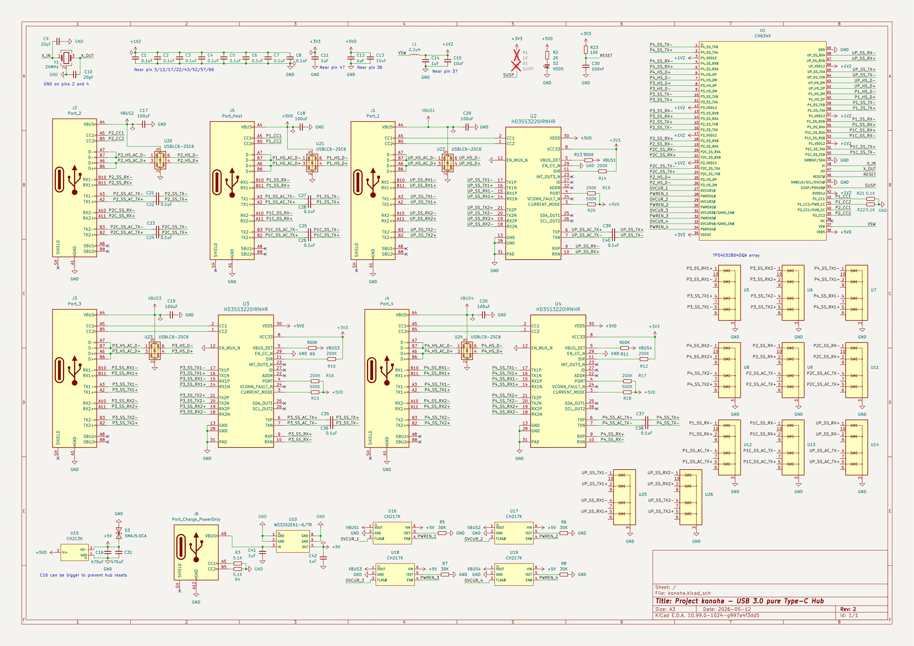
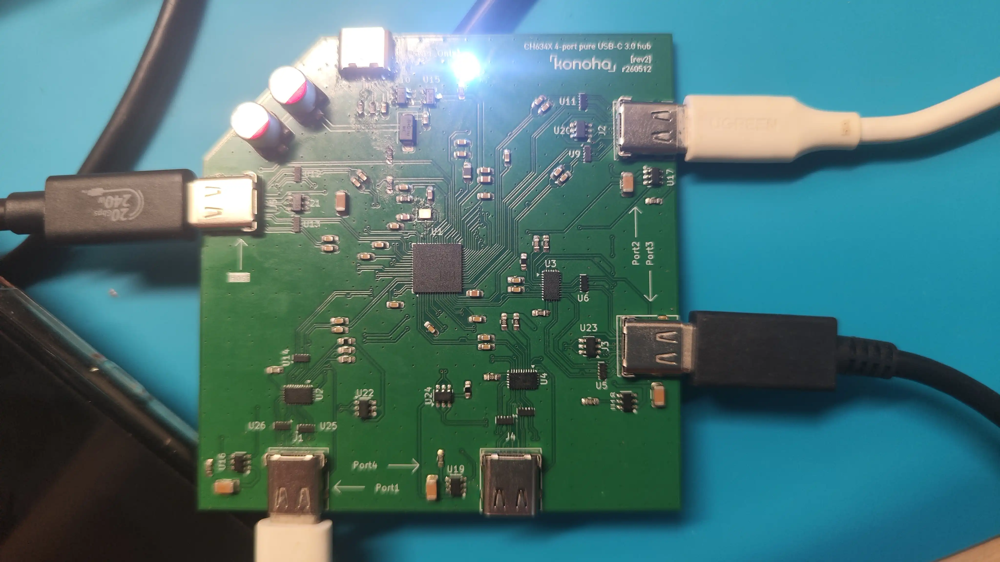
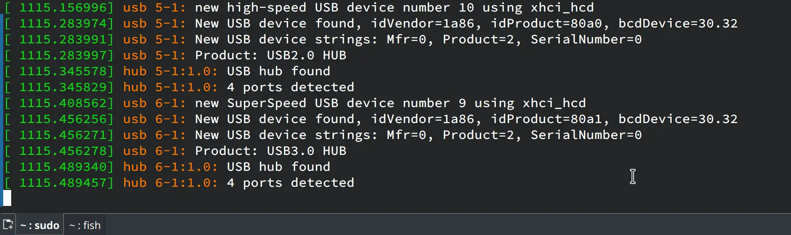
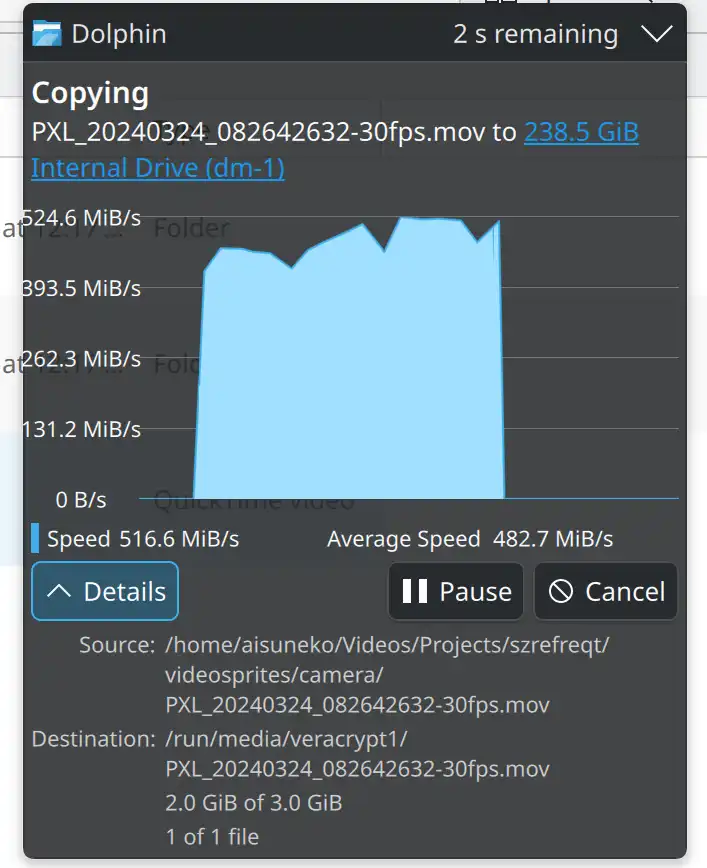

# Project "konoha"

4-port pure Type-C USB3.0 hub, based on WCH CH634X.

We have:
- All 4 ports in Type-C
- max. approx. USB3.2Gen1 transfer rate (~500MB/s); compatible with USB2.0
- Dedicated charging port
- Adequate ESD protection
- A symmetrical look
- One-sided components for ease of assembly

Name is inspired by Akisato Konoha from *16-bit Sensation*.

## Schematic

Aside from my original idea of forcefully converting the three USB-A downstream ports provided by the CH634X to Type-C, it is largely based on CH634X's reference design with modifications.

Datasheets of the most important chips used in this design could be found under [docs](./docs/).

TL;DR: The USB-A to C conversion is done with TI's HD3SS3220 analog muxes (which appears to be as costly as the CH634X controller itself). CH217 is used for OVC protection while the CH213 diode realize the isolation between 5V and 5VD. ESD protection is realized by the TPD4E02B04 array (USBSS) and USBLC6-2SC6 (USBFS).

## Board

See the board in action:

The board is fabricated using JLCPCB's default JLC04161H-3313 stackup so it should be fairly easy to order your own. Feel free to share any feedback and suggestions on the board design and component routing as I'm also new to high-speed PCB design.

## Caveats

- The board is rather unstable with multiple devices transferring data simultaneously. Certain ports might trigger an occassional hub reset with `disabled by hub (EMI?), re-enabling...` in dmesg.

  Will try to fix in the next revision by improving EMI at the shields of the Type-C connectors, as well as revising the power supply circuit to ensure it's sufficient.

- BOM costs are a bit high; I'll see if I can switch to a cheaper analog mux to reduce costs (and perhaps component count).

## Changelog

- rev1 (2025/11/28): first failed prototype. I can't get it soldered properly in the first place
- rev2 (2026/05/12): Initial working release

## License

As no firmware is involved in this project, it's under `CERN-OHL-S-2.0`.
